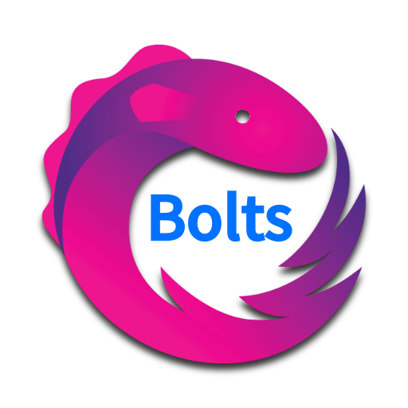

# RxBolts

[](https://jitpack.io/#yongjhih/RxBolts)
[](http://www.javadoc.io/doc/com.infstory/rxbolts/)
[](https://travis-ci.org/yongjhih/RxBolts)
[](https://gitter.im/yongjhih/RxBolts?utm_source=badge&utm_medium=badge&utm_campaign=pr-badge&utm_content=badge)
<!--[](http://android-arsenal.com/details/1/1670)-->
<!--[ ](https://bintray.com/yongjhih/maven/RxBolts/_latestVersion)-->
<!--[](https://www.bountysource.com/teams/8tory/bounties?utm_source=8tory&utm_medium=shield&utm_campaign=bounties_posted)-->

[](art/rxbolts.png)

Reactive [Bolts-Android](https://github.com/BoltsFramework/Bolts-Android). Allow convert `Task<T>` to `Observable<T>`.

## Usage

TaskObservable.defer():

```java
Task<String> helloTask = Task.forResult("Hello, world!");
TaskObservable.defer(() -> helloTask).subscribe(it -> {
  System.out.println(it);
}, e -> {
  // ..
});
```

TaskObservable.defer() with nullTask:

```java
Task<String> nullTask = Task.forResult(null);
TaskObservable.defer(() -> nullTask).subscribe(it -> {
  // ..
}, e -> {
  // ..
}, () -> {
  System.out.println("onCompleted");
});
```

TaskObservable.deferNullable():

```java
Task<String> helloTask = Task.forResult("Hello, world!");
TaskObservable.deferNullable(() -> helloTask).subscribe(it -> {
  System.out.println(it);
}, e -> {
  // ..
});

Task<String> nullTask = Task.forResult(null);
TaskObservable.deferNullable(() -> nullTask).subscribe(it -> {
  System.out.println(it); // print null
}, e -> {
  // ..
});
```

TaskObservable.deferNonNull():

```java
Task<String> helloTask = Task.forResult("Hello, world!");

TaskObservable.deferNonNull(() -> helloTask).subscribe(it -> {
  System.out.println(it);
}, e -> {
  // ..
});

Task<String> nullTask = Task.forResult(null);
TaskObservable.deferNonNull(() -> nullTask).subscribe(it -> {
  // ..
}, e -> {
  e.printStackTrace(); // NullPointerException
});

```

### Error handling

Failed:

```java
Task<String> failedTask = Task.forError(new RuntimeException("An error message."));
TaskObservable.defer(() -> failedTask).subscribe(it -> {
  // ..
}, e -> {
  e.printStackTrace();
});
```

## Sample code

* [RxParse](https://github.com/yongjhih/RxParse): https://github.com/yongjhih/RxParse/blob/master/rxparse/src/main/java/rx/parse/ParseObservable.java

## Installation

via jcenter

```gradle
repositories {
    jcenter()

}

dependencies {
    compile 'com.infstory:rxbolts:1.0.0'
}
```

Or via jitpack.io

```gradle
repositories {
    jcenter()
    maven { url "https://jitpack.io" }
}

dependencies {
    compile 'com.github.yongjhih:rxbolts:1.0.0'
}
```

## ref.

* https://github.com/BoltsFramework/Bolts-Android
* https://github.com/yongjhih/RxParse

## LICENSE

Copyright 2015 8tory, Inc.

Licensed under the Apache License, Version 2.0 (the "License"); you may not use this file except in compliance with the License. You may obtain a copy of the License at

http://www.apache.org/licenses/LICENSE-2.0

Unless required by applicable law or agreed to in writing, software distributed under the License is distributed on an "AS IS" BASIS, WITHOUT WARRANTIES OR CONDITIONS OF ANY KIND, either express or implied. See the License for the specific language governing permissions and limitations under the License.
